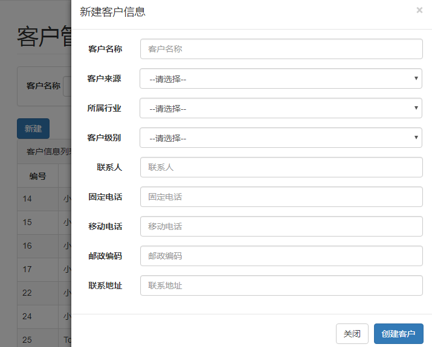

# SSM-CRM
项目介绍：使用SSM开源框架实现客户管理系统的小项目

# 一、系统开发环境：
操作系统：Windows
Web服务器：Tomcat8.0
Java开发包：JDK8
开发工具：Eclipse Java EE IDE for Web Developers
数据库：MySQL 5.5
浏览器：火狐或IE8.0以上版本 

 

***

# 二、项目框架层次
BOOT客户管理系统分为几个层次？
持久对象层（也称持久层或持久化层）：该层由若干持久化类（实体类）组成。

数据访问层（DAO层）：该层由若干DAO接口和MyBatis映射文件组成。接口的名称统一以Dao结尾，且MyBatis的映射文件名称要与接口的名称相同。

业务逻辑层（Service层）：该层由若干Service接口和实现类组成。在本系统中，业务逻辑层的接口统一使用Service结尾，其实现类名称统一在接口名后加Impl。该层主要用于实现系统的业务逻辑。

Web表现层：该层主要包括Spring MVC中的Controller类和JSP页面。Controller类主要负责拦截用户请求，并调用业务逻辑层中相应组件的业务逻辑方法来处理用户请求，然后将相应的结果返回给JSP页面。 

 

***

# 三、数据库设计

本系统中主要涉及到用户登录和客户管理功能，因此在系统中会涉及到系统用户表和客户信息表。
除此之外，客户信息中的客户来源和所属行业等内容是根据数据字典表中的信息查询出的，所以还会涉及到一个数据字典表。

***

# 四、用户登录模块设计
代码设计过程如下： 
  
另外加一个拦截器：
只有已登录用户的请求才能够通过，而对于未登录用户的请求，系统会将请求转发到登录页面，并提示用户登录。

***

# 五、客户管理模块设计
查询客户：BOOT客户管理系统的查询功能需要实现的功能包括按条件查询、查询所有客户信息，以及分页查询 

 
 
 ***
 
添加客户：新建 

 
 
 ***
 
 
修改客户：修改信息 

***

删除客户：弹出确认框 

***

# 六、最后效果展示
  
 ***
  

***

# 七、说明
这是一个入门级的SSM框架运用，实现了基本的客户管理系统功能，比较适合初级入门学习的朋友
本仓库文件说明：
BOOT客户管理系统.ppt详细介绍了系统的实现
boot-crm是项目源代码，含sql文件，使用前请先将其导入自己的数据库中
有任何问题可在
https://andyofjuly.github.io/
个人博客留言
